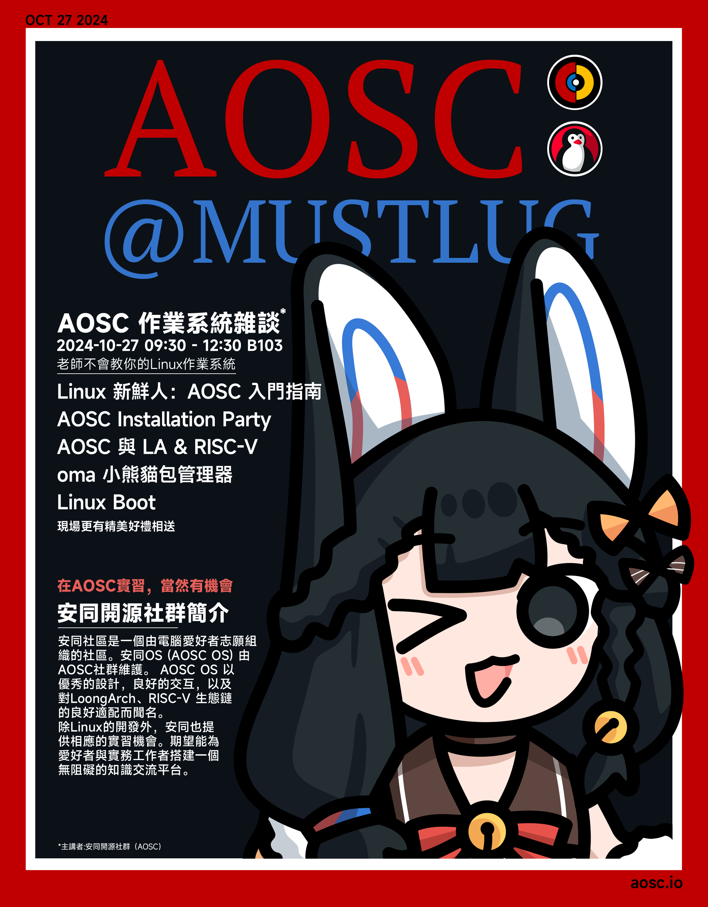

安同是一個基於 Linux 的開源系統，意味著人人都可以在遵守開源規則的前提下，修改代碼以獲取自己想要的功能。爲此，安同建立了開源社區，致力於提倡技術共享、保護開源生態的志願社羣。目前，安同維護的主要項目有諸如安同 OS(AOSC OS)、星霞 OS(Afterglow)，以及一系列衍生出的周邊工具。除對 Linux 的開發外，安同也廣泛參與着社會活動，通過線下的聚會和項目傳授經驗，期望能爲愛好者與從業者們搭建一個無阻礙的知識交流平臺。

相對於其他 Unbutu、Fedora 等 Linux 發行版，AOSC 有著自己的獨特魅力。它專門為了小型設備做了優化，特別適用於對功耗和散熱敏感的設備上，例如筆記本電腦等場景。大幅度的靜態性能優化並不意味著簡陋的系統功能，AOSC 同時致力於做到開箱即用的用戶體驗，提供了豐富的軟件源，對開源或閉源軟件支持良好。如閣下對於 Windows 程序有需求，AOSC 也內置 Wine，可以在 AOSC 上快速地運行 Windows 程序。

這個活動是為了更好地讓大家了解 AOSC，並且希望 AOSC 能作為一個解決方案，幫助大家更好地使用電腦，同時也能學習到 Linux 的知識與使用經驗。

# 活動調查問卷

如果閣下對於 AOSC 有興趣，請填寫以下調查問卷，以便我們更好地了解您感興趣的領域，您所填寫的寶貴信息將會幫助我們更好地準備演講內容。

[問卷調查鏈接](https://forms.office.com/r/eSs9LfSgDJ)

# 具體信息

時間：2024 年 10 月 27 日 早 9 时 30 分至下午 1 时
地點：B103 教室
主講者：AOSC 開源社區成員 白铭骢

# 活动海报

